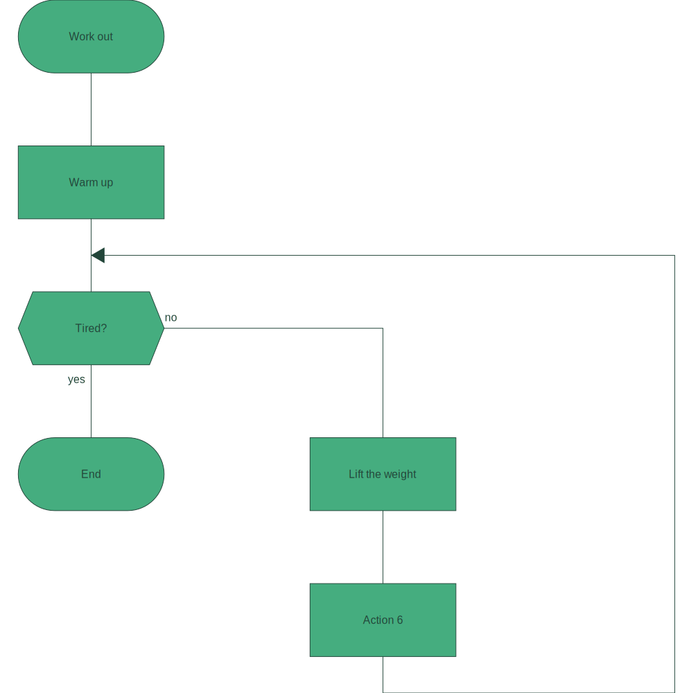
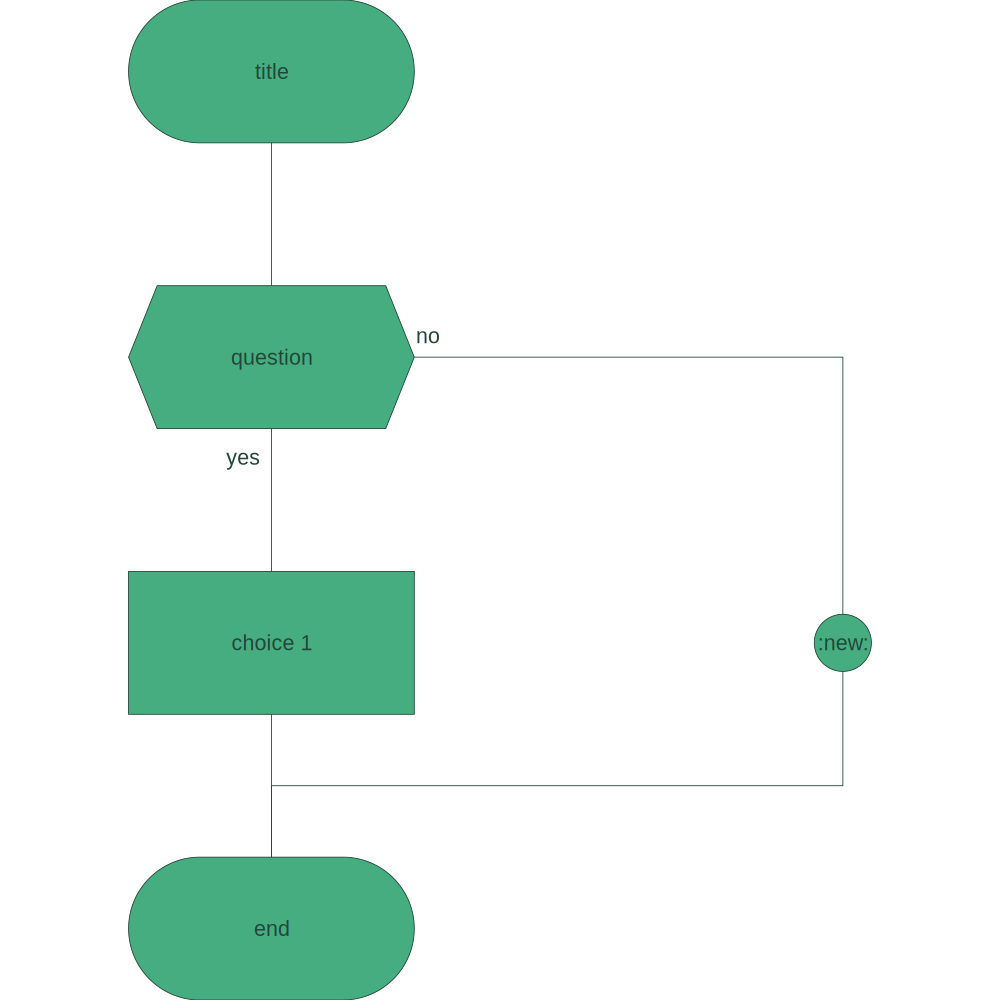
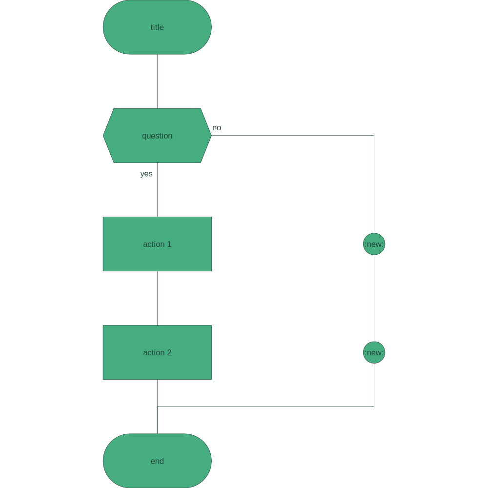
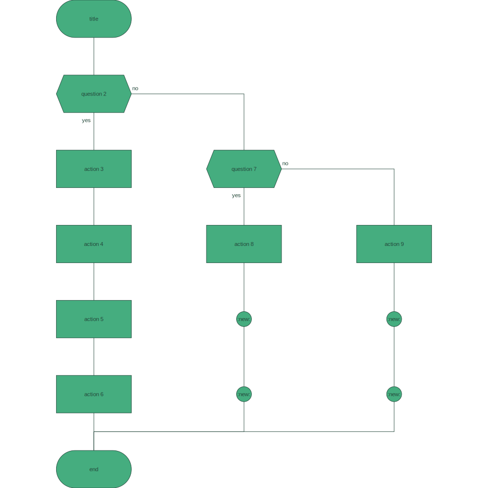
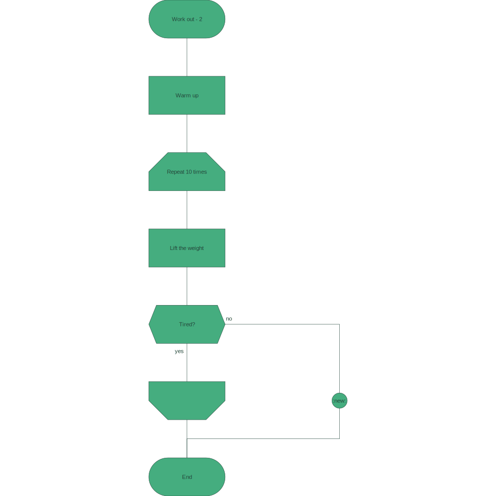
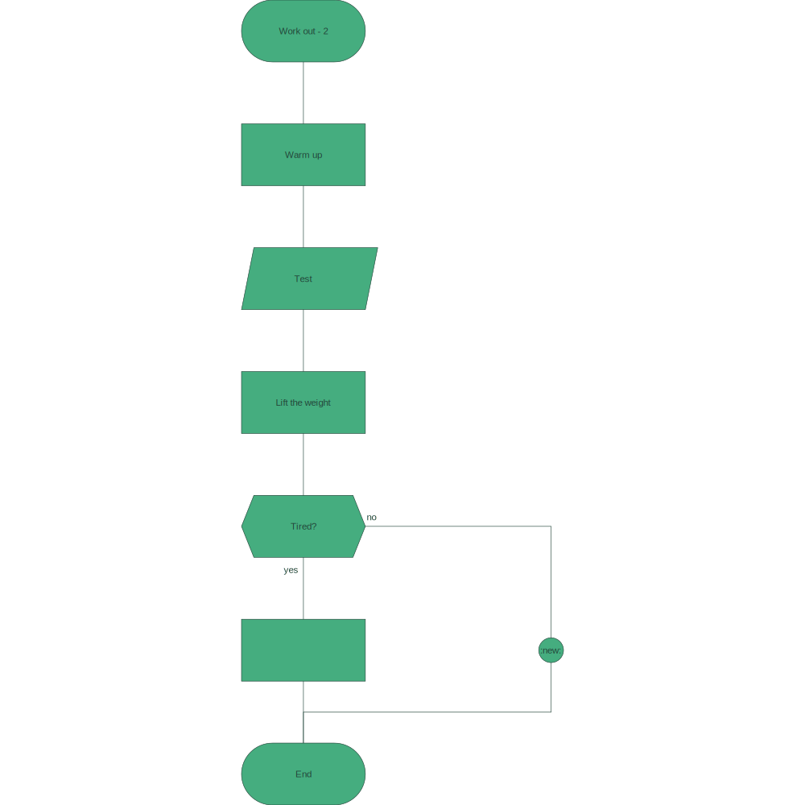

# drakon-renderer

Reasonably portable drakon diagrams renderer. Development, compilation and execution are intended to take place in containers.

**Important:**

this is work in progress and, while progress is being made every week, the renderer is not yet guaraneed to render drakon-correct diagrams. Current focus is to render primitive diagrams according to drakon rules.

| primitive diagram 1 | primitive diagram 2 | primitive diagram 3 |
| --- | --- | --- |
|  |  |  |

| primitive diagram 4 | primitive diagram 5 | primitive diagram 6 |
| --- | --- | --- |
|  |  |  |

## terminology

* `Title` - first step of a diagram
* `End` - last step of a diagram
* `Action` - "do X" non-branching action, basic building block of a diagram
* `Question` - branching step with two possible outcomes:
  * yes
  * no
* `Headline`
* `Address`
* `ForStart`
* `ForEnd`
* `Choice`
* `Case`
* `Primitive`
* `Silhouette`

## input syntax

```json
[
    {
        "iconDescription": "title",
        "iconKind": "Title",
        "iconName": "1",
        "iconNamesOfDependentIcons": [
            "2"
        ]
    },
    {
        "iconDescription": "question",
        "iconKind": "Question",
        "iconName": "2",
        "iconNamesOfDependentIcons": [
            "3",
            "4"
        ]
    },
    {
        "iconDescription": "choice 1",
        "iconKind": "Action",
        "iconName": "3",
        "iconNamesOfDependentIcons": [
            "4"
        ]
    },
    {
        "iconDescription": "end",
        "iconKind": "End",
        "iconName": "4",
        "iconNamesOfDependentIcons": []
    }
]
```

## output

### balanced paths

The idea is to trace all available paths from the title icon to the end icon and then alter them in such a way that all paths end up with the same number of icons and valent points (where possible - some paths will naturally have more elements).

| path 1 | path 2 |
| --- | --- |
| **1** - title ["2"] | **1** - title ["2"] |
| **2** - question ["3","4"] | **2** - question ["3","4"] |
| **3** - choice 1 ["4"] | **v1** - :new: [] |
| **4** - end [] | **4** - end [] |

\*where the "v1" icon describes an automatically injected valent point.

### positioned icons

Serialized list of `PositionedIcon` which are regular `Icon` supplemented with their post-layout cartesian coordinates:

WIP at the moment - layout engine does not leverage automatically injected valent points yet. Rendered results will look correct, but the engine needs to start accepting automatically injected valent points.

```json
[
    {
        "icon": {
            "iconDescription": "title",
            "iconKind": "Title",
            "iconName": "1",
            "iconNamesOfDependentIcons": [
                "2"
            ]
        },
        "iconPositionX": 0,
        "iconPositionY": 0
    },
    {
        "icon": {
            "iconDescription": "question",
            "iconKind": "Question",
            "iconName": "2",
            "iconNamesOfDependentIcons": [
                "3",
                "4"
            ]
        },
        "iconPositionX": 0,
        "iconPositionY": -1
    },
    {
        "icon": {
            "iconDescription": "choice 1",
            "iconKind": "Action",
            "iconName": "3",
            "iconNamesOfDependentIcons": [
                "4"
            ]
        },
        "iconPositionX": 0,
        "iconPositionY": -2
    },
    {
        "icon": {
            "iconDescription": "end",
            "iconKind": "End",
            "iconName": "4",
            "iconNamesOfDependentIcons": []
        },
        "iconPositionX": 0,
        "iconPositionY": -3
    }
]
```

* an svg diagram:


## method

1. read serialized collection of `Icon`s & deserialize

2. validate Icons (only one title icon per diagram, correct numbers of dependencies, etc.) - sample validation:

    ```bash
    Input validation did not succeed for following reasons:
    * Error: Icons identified with following names contain incorrect number of dependencies: "8", "3", "2". Hint: Make sure your icons have the expected number of dependencies. For reference: "Title" and "Action" icons should have 1 depdenency, "Question" icon should have 2 dependencies and "End" should have no dependencies.
    * Error: Diagram is required to have exactly one icon of kind "End". Hint: Make sure your input diagram contains an icon of kind "End" and that it is the only icon of that kind.
    * Error: Diagram is required to have exactly one icon of kind "Title". Hint: Make sure your input diagram contains an icon of kind "Title" and that it is the only icon of that kind.
    ```

3. if validation is successful, attempt to balance all paths leading from the title icon to the end icon (balance - align matching icons, make sure that paths are of equal length where applicable)

4. save the balanced paths as an easy to troubleshoot markdown file where:

    * input: `file.json`

    * output: `file-balanced-paths.md`

5. attempt to position the directed graph's nodes on a cartesian plane:

    * positive integer x coordinates only

    * negative integer y coordinates only

6. serialize the product (`[PositionedIcon]`) to a file where:

    * input: `file.json`

    * output: `file-drakon-layout.json`

7. Render the collection of `PositionedIcon`s into the final svg diagram.

8. Render the connections between the collection of `PositionedIcon`s into the final svg diagram.

## development environment

| command | description |
| --- | --- |
| `./start-development-environment.sh` or `.\start-development-environment.ps1` | starts a fully dockerized development environment |
| `./build.sh` | builds and lints code - preferrably while development environment docker container is running, otherwise local installation of cabal and hlint is required) |
| `./run.sh` | runs code - just like the build script, the preferred way to use it is while the development environment is running |
| `./demo-run.sh` | runs the renderer with all diagrams contained in the repository |
| `./format.sh` | formats all `*.hs` files located in the `./app` directory using [hindent](https://github.com/mihaimaruseac/hindent) |
| `exit` | terminates development environment |

## project status

You can see into the bigger ideas I have for the project (past, present, future) here: [dev-log.md](./dev-log.md).

## community

* [youtube](https://www.youtube.com/playlist?list=PL9-WsOrOzOxSqWNqzhzyBGZsN0sOxEF6Q)

## resources

* [drakon whitepaper](https://drakon.su/_media/video_i_prezentacii/graphical_syntax_.pdf)

* [drakon wiki](https://en.m.wikipedia.org/wiki/DRAKON)

* [drakon.su](https://drakon.su/start)

* [drakon](https://drakonhub.com/read/docs)

* [diagrams](https://archives.haskell.org/projects.haskell.org/diagrams/doc/quickstart.html#introduction)

* [diagrams - user manual](https://archives.haskell.org/projects.haskell.org/diagrams/doc/manual.html)

* [colours](https://www.colourlovers.com)

* [colorkit](https://colorkit.co/)

  * [default palette](https://colorkit.co/palette/642915-963e20-c7522a-e5c185-fbf2c4-74a892-008585-006464-004343/)

* useful haskell modules:

  * [GHC.Data.Graph.Directed](https://hackage.haskell.org/package/ghc-9.4.7/docs/GHC-Data-Graph-Directed.html)

  * [GHC.Utils.Outputable](https://hackage.haskell.org/package/ghc-9.4.7/docs/GHC-Utils-Outputable.html)

* if you struggle with `.git` permissions, try:

  ```bash
  # Note: Use this command with caution as it changes file ownership. Only run it if you understand the security implications.
  sudo chown -R yourusername .git
  ```
