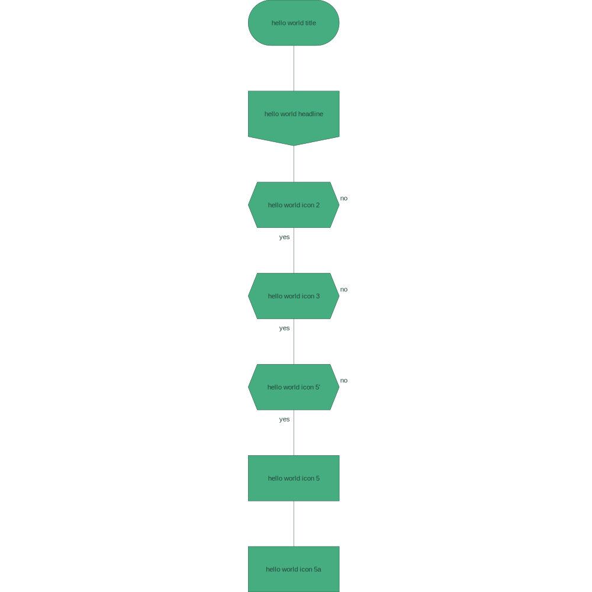

# drakon-renderer

Reasonably portable drakon diagrams renderer. Development, compilation and execution are intended to take place in containers.

## terminology

* `Title` - first step of a diagram
* `End` - last step of a diagram
* `Action` - "do X" non-branching action, basic building block of a diagram
* `Question` - branching step with two possible outcomes:
  * yes
  * no

[source 1 - wikipedia](https://en.m.wikipedia.org/wiki/DRAKON#/media/File%3AIcons_of_Visual_Programming_Language_--DRAKON--.png)

[source 2 - wikipedia](https://en.m.wikipedia.org/wiki/DRAKON)

[source 3 - drakon.su](https://drakon.su/start)

## input syntax

```json
[
    {
        "iconDescription": "hello world title",
        "iconKind": "Title",
        "iconName": "1",
        "iconNamesOfDependentIcons": [
            "2"
        ]
    },
    {
        "iconDescription": "hello world icon 2",
        "iconKind": "Action",
        "iconName": "2",
        "iconNamesOfDependentIcons": [
            "3",
            "4"
        ]
    },
    ...
]
```

## output

* a pretty printed directed graph sent to stdout, resulting from deserializing input icons:

```
Vertices:
(Icon {iconName = "1", iconDescription = "hello world title", iconNamesOfDependentIcons = ["2"], iconKind = Title}, 1, [2])
(Icon {iconName = "2", iconDescription = "hello world icon 2", iconNamesOfDependentIcons = ["3","4"], iconKind = Action}, 2, [3, 4])
(Icon {iconName = "3", iconDescription = "hello world icon 3", iconNamesOfDependentIcons = ["5","6","7"], iconKind = Action}, 3, [5, 6, 7])
(Icon {iconName = "4", iconDescription = "hello world icon 4", iconNamesOfDependentIcons = ["8"], iconKind = Action}, 4, [8])
(Icon {iconName = "5", iconDescription = "hello world icon 5", iconNamesOfDependentIcons = ["8"], iconKind = Action}, 5, [8])
(Icon {iconName = "6", iconDescription = "hello world icon 6", iconNamesOfDependentIcons = ["8"], iconKind = Action}, 6, [8])
(Icon {iconName = "7", iconDescription = "hello world icon 7", iconNamesOfDependentIcons = ["8"], iconKind = Action}, 7, [8])
(Icon {iconName = "8", iconDescription = "hello world end", iconNamesOfDependentIcons = [], iconKind = End}, 8, [])
Edges:
(Icon {iconName = "1", iconDescription = "hello world title", iconNamesOfDependentIcons = ["2"], iconKind = Title}, 1, [2]) -> (Icon {iconName = "2", iconDescription = "hello world icon 2", iconNamesOfDependentIcons = ["3","4"], iconKind = Action}, 2, [3, 4])
(Icon {iconName = "2", iconDescription = "hello world icon 2", iconNamesOfDependentIcons = ["3","4"], iconKind = Action}, 2, [3, 4]) -> (Icon {iconName = "3", iconDescription = "hello world icon 3", iconNamesOfDependentIcons = ["5","6","7"], iconKind = Action}, 3, [5, 6, 7])
(Icon {iconName = "2", iconDescription = "hello world icon 2", iconNamesOfDependentIcons = ["3","4"], iconKind = Action}, 2, [3, 4]) -> (Icon {iconName = "4", iconDescription = "hello world icon 4", iconNamesOfDependentIcons = ["8"], iconKind = Action}, 4, [8])
(Icon {iconName = "3", iconDescription = "hello world icon 3", iconNamesOfDependentIcons = ["5","6","7"], iconKind = Action}, 3, [5, 6, 7]) -> (Icon {iconName = "5", iconDescription = "hello world icon 5", iconNamesOfDependentIcons = ["8"], iconKind = Action}, 5, [8])
(Icon {iconName = "3", iconDescription = "hello world icon 3", iconNamesOfDependentIcons = ["5","6","7"], iconKind = Action}, 3, [5, 6, 7]) -> (Icon {iconName = "6", iconDescription = "hello world icon 6", iconNamesOfDependentIcons = ["8"], iconKind = Action}, 6, [8])
(Icon {iconName = "3", iconDescription = "hello world icon 3", iconNamesOfDependentIcons = ["5","6","7"], iconKind = Action}, 3, [5, 6, 7]) -> (Icon {iconName = "7", iconDescription = "hello world icon 7", iconNamesOfDependentIcons = ["8"], iconKind = Action}, 7, [8])
(Icon {iconName = "4", iconDescription = "hello world icon 4", iconNamesOfDependentIcons = ["8"], iconKind = Action}, 4, [8]) -> (Icon {iconName = "8", iconDescription = "hello world end", iconNamesOfDependentIcons = [], iconKind = End}, 8, [])
(Icon {iconName = "5", iconDescription = "hello world icon 5", iconNamesOfDependentIcons = ["8"], iconKind = Action}, 5, [8]) -> (Icon {iconName = "8", iconDescription = "hello world end", iconNamesOfDependentIcons = [], iconKind = End}, 8, [])
(Icon {iconName = "6", iconDescription = "hello world icon 6", iconNamesOfDependentIcons = ["8"], iconKind = Action}, 6, [8]) -> (Icon {iconName = "8", iconDescription = "hello world end", iconNamesOfDependentIcons = [], iconKind = End}, 8, [])
(Icon {iconName = "7", iconDescription = "hello world icon 7", iconNamesOfDependentIcons = ["8"], iconKind = Action}, 7, [8]) -> (Icon {iconName = "8", iconDescription = "hello world end", iconNamesOfDependentIcons = [], iconKind = End}, 8, [])
```

* a serialized list of `PositionedIcon` which are regular `Icon` supplemented with their post-layout cartesian coordinates:

```json
[
    {
        "icon": {
            "iconDescription": "hello world title",
            "iconKind": "Title",
            "iconName": "1",
            "iconNamesOfDependentIcons": [
                "2"
            ]
        },
        "iconPositionX": 0,
        "iconPositionY": 0
    },
    {
        "icon": {
            "iconDescription": "hello world icon 2",
            "iconKind": "Action",
            "iconName": "2",
            "iconNamesOfDependentIcons": [
                "3",
                "4"
            ]
        },
        "iconPositionX": 0,
        "iconPositionY": -1
    },
    ...
]
```

* an svg diagram:



## method

1. read serialized collection of `Icon`s & deserialize

2. translate `Icon`s to a directed graph so they can be layed out on a cartesian plane

3. validate Icons (only one title icon per diagram, correct numbers of dependencies, etc.) - sample input validation:

    ```
    Input validation did not succeed for following reasons:
    * Error: Icons identified with following names contain incorrect number of dependencies: "8", "3", "2". Hint: Make sure your icons have the expected number of dependencies. For reference: "Title" and "Action" icons should have 1 depdenency, "Question" icon should have 2 dependencies and "End" should have no dependencies.
    * Error: Diagram is required to have exactly one icon of kind "End". Hint: Make sure your input diagram contains an icon of kind "End" and that it is the only icon of that kind.
    * Error: Diagram is required to have exactly one icon of kind "Title". Hint: Make sure your input diagram contains an icon of kind "Title" and that it is the only icon of that kind.
    ```

4. if validation is successful, attempt to position the directed graph's nodes on a cartesian plane:

    * positive integer x coordinates only

    * negative integer y coordinates only

5. serialize the product (`[PositionedIcon]`) to a file where:

    * input: `file.json`

    * output: `file-drakon-layout.json`

6. Render the collection of `PositionedIcon`s into the final svg diagram.

7. Render the connections between the collection of `PositionedIcon`s into the final svg diagram.

## development environment

| command | description |
| --- | --- |
| `./start-development-environment.sh` | starts a fully dockerized development environment |
| `./build.sh` | builds and lints code - preferrably while development environment docker container is running, otherwise local installation of cabal and hlint is required) |
| `./run.sh` | runs code - just like the build script, the preferred way to use it is while the development environment is running |
| `exit` | terminates development environment |

## project status

You can see into the bigger ideas I have for the project (past, present, future) here: [dev-log.md](./dev-log.md).

## resources

* [drakon wiki](https://en.m.wikipedia.org/wiki/DRAKON)

* [drakon](https://drakonhub.com/read/docs)

* [diagrams](https://archives.haskell.org/projects.haskell.org/diagrams/doc/quickstart.html#introduction)

* [diagrams - user manual](https://archives.haskell.org/projects.haskell.org/diagrams/doc/manual.html)

* [colours](https://www.colourlovers.com)

* [colorkit](https://colorkit.co/)

  * [default palette](https://colorkit.co/palette/642915-963e20-c7522a-e5c185-fbf2c4-74a892-008585-006464-004343/)

* useful haskell modules:

  * [GHC.Data.Graph.Directed](https://hackage.haskell.org/package/ghc-9.4.7/docs/GHC-Data-Graph-Directed.html)

  * [GHC.Utils.Outputable](https://hackage.haskell.org/package/ghc-9.4.7/docs/GHC-Utils-Outputable.html)
