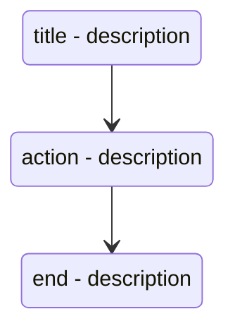

# drakon-renderer

Haskell drakon renderer.

## troubleshooting mode off


## troubleshooting mode on


## syntax

Proposed input syntax to be converted to diagram images:

```
Title t "title - description"
Action a1 "action - description"
End e "end - description"

t > a1
a1 > e
```

This would render something like the following mermaid:



So two sections:

* icon definitions
* icon connections

But this is subject to change.

## terminology

* title - first step of a diagram
* end - last step of a diagram
* action - "do X" non-branching action, basic building block of a diagram
* question - branching step with two possible outcomes:
  * yes
  * no

[source 1](https://en.m.wikipedia.org/wiki/DRAKON#/media/File%3AIcons_of_Visual_Programming_Language_--DRAKON--.png)

[source 2](https://en.m.wikipedia.org/wiki/DRAKON)

## development environment

| command | description |
| --- | --- |
| `./host.sh` | starts development environment |
| `./build.sh` | builds and lints code |
| `./run.sh` | runs code |
| `hlint .` | scans the whole current directory with hlint |
| `exit` | terminates development environment |

## resources

* [drakon wiki](https://en.m.wikipedia.org/wiki/DRAKON)
* [drakon](https://drakonhub.com/read/docs)
* [diagrams](https://archives.haskell.org/projects.haskell.org/diagrams/doc/quickstart.html#introduction)
* [diagrams - user manual](https://archives.haskell.org/projects.haskell.org/diagrams/doc/manual.html)
* [colours](https://www.colourlovers.com)
* [colorkit](https://colorkit.co/)
  * [default palette](https://colorkit.co/palette/642915-963e20-c7522a-e5c185-fbf2c4-74a892-008585-006464-004343/)
* useful haskell modules:
  * [GHC.Data.Graph.Directed](https://hackage.haskell.org/package/ghc-9.4.7/docs/GHC-Data-Graph-Directed.html)
  * [GHC.Utils.Outputable](https://hackage.haskell.org/package/ghc-9.4.7/docs/GHC-Utils-Outputable.html)