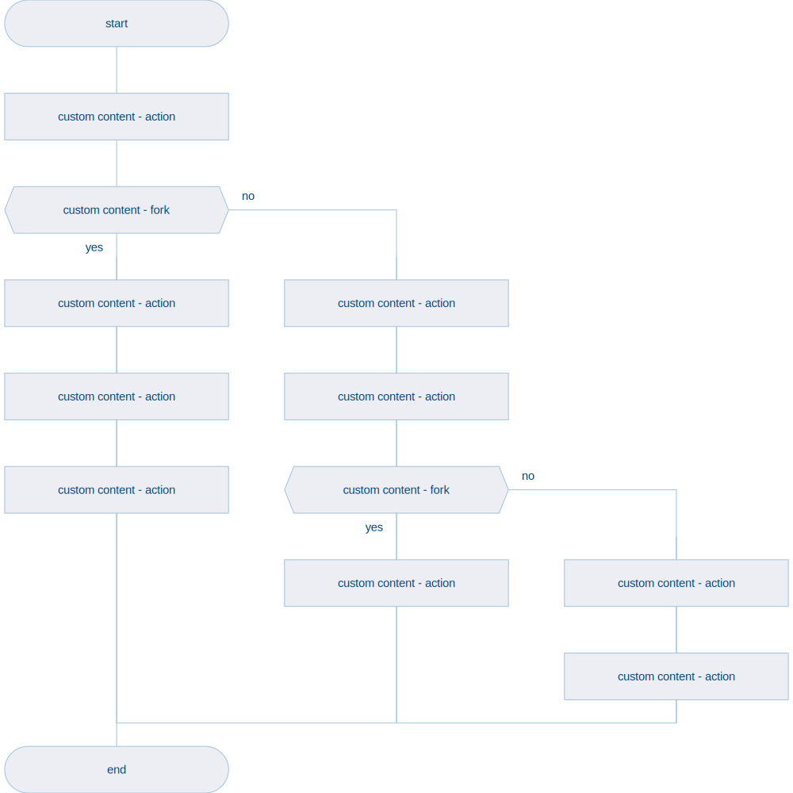
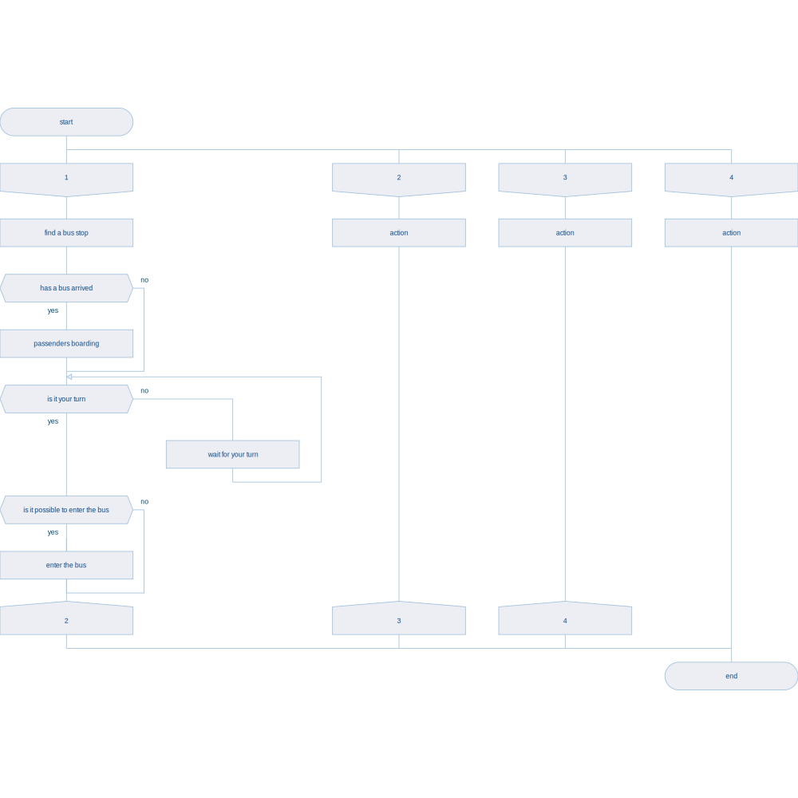

# drakon-renderer

Reasonably portable drakon-esque diagrams renderer. Development, compilation and execution are intended to take place in containers.

**Important:**

This is work in progress and, while progress is being made every week, the renderer is not yet guaraneed to render drakon-correct diagrams (we're getting close, though, I feel!). Current focus is to translate [the drakon whitepaper](https://drakon.su/_media/video_i_prezentacii/graphical_syntax_.pdf) into a Haskell-friendly set of types and functions.

Sample diagrams the renderer can produce today:

| name | output |
| --- | --- |
| primitive diagram 1 |  |
| primitive diagram 2 |  |
| primitive diagram 3 |  |
| silhouette diagram 1 |  |

## development environment

| command | description |
| --- | --- |
| `./start-development-environment.sh` | starts a fully dockerized development environment |
| `./build.sh` | builds and lints code - preferrably while development environment docker container is running, otherwise local installation of cabal and hlint is required) |
| `./run.sh` | runs code - just like the build script, the preferred way to use it is while the development environment is running |
| `./format.sh` | formats all `*.hs` files located in the `./app` directory using [hindent](https://github.com/mihaimaruseac/hindent) |
| `exit` | terminates development environment |

* `hlint` installation is removed from the dockerfile as it causes an error during the image build process (apologies, did not take a note what exactly is failing). To install `hlint` locally, run `cabal install hlint`.

## community

* [youtube](https://www.youtube.com/playlist?list=PL9-WsOrOzOxSqWNqzhzyBGZsN0sOxEF6Q)

## resources

* [drakon whitepaper](https://drakon.su/_media/video_i_prezentacii/graphical_syntax_.pdf)

* [drakon wiki](https://en.m.wikipedia.org/wiki/DRAKON)

* [drakon.su](https://drakon.su/start)

* [drakon](https://drakonhub.com/read/docs)

* [diagrams](https://archives.haskell.org/projects.haskell.org/diagrams/doc/quickstart.html#introduction)

* [diagrams - user manual](https://archives.haskell.org/projects.haskell.org/diagrams/doc/manual.html)

* [colours](https://www.colourlovers.com)

* [colorkit](https://colorkit.co/)

  * [default palette](https://colorkit.co/palette/642915-963e20-c7522a-e5c185-fbf2c4-74a892-008585-006464-004343/)

* useful haskell modules:

  * [GHC.Data.Graph.Directed](https://hackage.haskell.org/package/ghc-9.4.7/docs/GHC-Data-Graph-Directed.html)

  * [GHC.Utils.Outputable](https://hackage.haskell.org/package/ghc-9.4.7/docs/GHC-Utils-Outputable.html)

* if you struggle with `.git` permissions, try:

  ```bash
  # Note: Use this command with caution as it changes file ownership. Only run it if you understand the security implications.
  sudo chown -R yourusername .git
  ```
