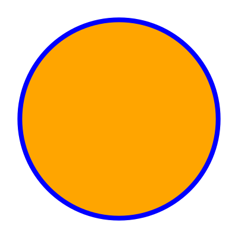

# 2024-10-22

Real life drakon diagrams, together with the drakon whitepaper (see [here](https://drakon.su/_media/video_i_prezentacii/graphical_syntax_.pdf)) made me realize that the layout algorithm, while improving, is not there yet. I realized that diagrams should be equipped with valent points in order to follow drakon rules better so I'm focusing my energy now on this issue: https://github.com/PiotrJustyna/drakon-renderer/issues/89

* draphs should consist of valent points which may or may not host user-provided icons

* that should simplify the layout algorithm and the algorithm connecting rendered icons

* in more distant future I will have to rethink how icons/positioned icons/valent points are represented as data types in order to make the project more faithful to the originally proposed drakon rules

We also have a discord channel now: https://discord.gg/eaJ7e4jF

# 2024-10-04

It feels like I made substantial progress in recent days when it comes to layout algorithm. I have just finished implementing yet another version of it and I'm pretty happy with it's current shape. Plan for immediate future is to continue with real life drakon diagrams and also to clean up connections between positioned icons.

# 2024-09-24

Just finished rewriting the layout algorithm. It took a while but it addresses the problem of the removed icons still having effect on their (still present) dependents' positions.

The process of rewriting that algorithm took a good degree of work and time, but as a bonus I was able to delete the ghc package as a dependency.

Next steps: finish cleaning up hlint hints, correct connections where x1 > x2, make more progress with the real life diagram.

# 2024-08-28

SVG rendering is now finally connected with the process of deserialization and positioning. Very happy with the results so far. In the upcoming days I am planning to clean up how the diagrams look like and then to move on to connecting the rendered icons with lines adhering to drakon rules.

# 2024-08-09

I have implemented basic error handling, but having glimpsed into the rabbit hole of Haskell exceptions I am positive that this is not something I want to explore at the moment. I think I could just get away with using simpler techniques (`Maybe` or `Either` monads instead of exceptions) and focus my attention instead on more valuable things like setting up a home server (I want this renderer to be a service) on my raspberry pi. I'm planning to focus on it for the time being and to gather my thoughts on a smooth transition from the `Icon` type to a new type that will represent positioned icons. For positioning I'm planning to use a simple cartesian plane - positive x corrdinates and negative y coordinates only.

# 2024-08-02

Reading drakon diagrams from json files is now working fine, or at least the happy path is. What I think would make sense now is a degree of error handling:

* starting from obvious basics like exception hangling - file missing, file larger than some sort of fixed max size, cannot deserialize, etc.
* to more advanced validation like:
    * length of a certain property is incorrect
    * icon dependencies identify icons not present in the diagram

This validation should be extensible (maybe a flexible group of predicates?) so that I can easily add more validation rules in the future.

# 2024-07-29

I am currently experimenting with different ways of providing diagram input reasonably easily. This is in order to be able to easily test various types of diagrams and spot any errors or inefficiencies with the renderer.

I have a reasonably well fleshed out renderer in place already but I'm never happy with it, so we can definitely expect some aspects of it to be reworked in the future.
